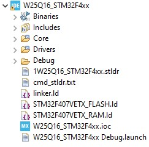

## Making your own external loader

Here is an external loader a code that helps the STM32CubeProgrammer to download the data "images.bin" to external memory like Winbond W25Q16.
For all STM-Boards you will get an external loader e.g. in sub folder "\bin\ExternalLoader" of STM32CubeProgrammer
If you have a no-name board, you have to make your own external loader for downloading data to external memory.
I have a no-name board with controller STM32F407 and an external memory from Winbond W25Q16.
If you have the same no-name board you can use the external loader 1W25Q16_STM32F4xx.stldr in this repository. Copy the file in sub folder "\bin\ExternalLoader" of STM32CubeProgrammer and you can choose them.
I added in the repository only the relevant folders.
In STM32CubeIDE it looks like this

Picture: Folder

An explanation to build an other external loader find you in the link below.

* https://github.com/maudeve-it/W25Qxxx_SPI_FLASH_STM32

For automatic renaming the elf-file you can use the command in cmd-stldr.txt.